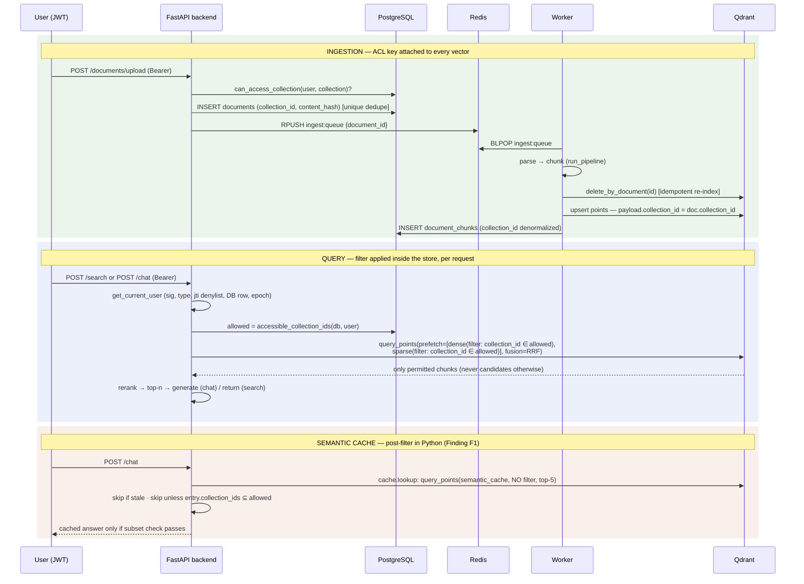

# AUDIT.md — Phase 0 Baseline Audit (Multimodal Migration)

Date: 2026-07-02 · Branch: `feat/multimodal-migration` · Scope: full existing codebase at commit `917f117`.

This document is the frozen "as-is" map of the platform prior to any migration work.
It covers: module map, service inventory, configuration, DB + Qdrant schemas, the
end-to-end ACL enforcement path (with sequence diagram and findings), the external
endpoint sweep, the dependency-pinning inventory, and the KEEP/REPLACE/NEW mapping
onto the target architecture in `CLAUDE.md`.

---

## 1. Service inventory

### 1.1 Production stack — `docker-compose.yml` (project `agentic-rag`)

All services: `env_file: [.env]`, `restart: unless-stopped`. Only `proxy` publishes a host port.

| Service | Image / Build | Healthcheck | depends_on (healthy) |
|---|---|---|---|
| `postgres` | `postgres:16-alpine` | `pg_isready` | — |
| `redis` | `redis:7-alpine` (`--save 60 1`) | `redis-cli ping` | — |
| `qdrant` | `qdrant/qdrant:v1.12.4` | TCP 6333 | — |
| `phoenix` | `arizephoenix/phoenix:latest` ⚠️ floating | GET `/healthz` | — |
| `vllm` | `vllm/vllm-openai:latest` ⚠️ floating · `ipc: host`, `shm_size 8gb`, 1× GPU | GET `/health` (start_period 300s) | — |
| `embeddings` | build `docker/embeddings.Dockerfile` (`INSTALL_MODELS=true`), GPU | GET `/health` | — |
| `vlm` | build `docker/vlm.Dockerfile`, `VLM_DEVICE=cpu`, `VISUAL_PATH=full` | GET `/health` | — |
| `backend` | build `docker/backend.Dockerfile` | GET `/health` | postgres, redis, qdrant, vllm, embeddings |
| `worker` | same image, `command: python -m worker.main` | heartbeat-file freshness | postgres, redis, qdrant, vlm |
| `admin-ui` | build `docker/admin-ui.Dockerfile` | GET `/healthz` | — |
| `proxy` | `nginx:1.27-alpine`, `docker/proxy.conf` | GET `/healthz` | backend, admin-ui |

Prod-injected env on `backend`/`worker`: `LLM_BASE_URL=http://vllm:8000/v1`,
`LLM_GEN_MODEL`/`LLM_CLASS_MODEL=${VLLM_SERVED_MODEL_NAME}`, `EMBEDDINGS_BACKEND=service`,
`RERANKER_BACKEND=service`. vLLM flags fully env-parameterized (model path, quantization=awq,
max-model-len, max-num-seqs, gpu-memory-utilization, tensor-parallel, scheduling-policy=priority,
guided-decoding-backend=xgrammar). Named volumes: `postgres_data`, `redis_data`, `qdrant_data`,
`phoenix_data`, `documents_data` (uploaded originals, mounted at `/data`).

### 1.2 Development stack — `docker-compose.dev.yml` (project `agentic-rag-dev`)

Differences from prod: `ollama/ollama:latest` ⚠️ replaces `vllm`; **no `vlm` service** (degraded
visual path); **no `proxy`**; all services publish host ports; `./app` + `./worker` bind-mounted
with `--reload`; embeddings runs in stub mode (backend uses in-process hashing embedder).

### 1.3 Process entrypoints

| Process | Entrypoint | Role |
|---|---|---|
| Backend API | `app/main.py` (uvicorn) | FastAPI: routers health/auth/collections/documents/search/chat/admin + `/metrics`, `/metrics/summary` |
| Worker | `worker/main.py` | `BLPOP [ingest:queue, eval:queue]` → `index_document` / LLM-judge eval; heartbeat file; retries to `MAX_INDEXING_RETRIES` |
| Embeddings | `services/embeddings/main.py` (port 8001) | `POST /embed` (BGE-M3 dense+sparse), `POST /rerank` (bge-reranker-v2-m3); stub unless `EMBEDDINGS_IMPLEMENTED=true` |
| VLM | `services/vlm/main.py` (port 8002) | `POST /summarize` — **stub, returns 501; no code calls it** (see §8) |
| Admin UI | Vite/React SPA (`admin-ui/app/`) via nginx | JWT auth against backend API; `VITE_API_BASE` = `/api` (prod, proxied) |

---

## 2. Configuration

Single source of truth: `app/config.py` — `pydantic-settings` `BaseSettings`
(`env_file=".env"`, `extra="ignore"`, case-insensitive), singleton via `@lru_cache get_settings()`.
This already satisfies migration Rule 7 (config over code); new multimodal tunables extend this module.

Groups (field → env var is the upper-cased name; defaults in parentheses):

- **Core:** `app_env` (dev), `log_level`, `backend_port` (8000), `cors_origins`.
- **Postgres:** user/password/db/host/port → computed `database_url_async` (asyncpg),
  `database_url_sync` (psycopg2, worker/alembic), `database_url_psycopg` (psycopg3, LangGraph checkpointer).
- **Redis:** host/port/db → `redis_url`. Used for: queues, rate limits, jti denylist, session epoch, cache tags.
- **Qdrant:** host/ports, `qdrant_collection` (`rag_chunks`) → `qdrant_url`.
- **Phoenix:** host/ports, `tracing_enabled`.
- **LLM:** `llm_base_url` (`http://ollama:11434/v1` dev / `http://vllm:8000/v1` prod),
  `llm_api_key`, `llm_gen_model`, `llm_class_model`, `llm_request_timeout_s`.
  **Note:** there is no `OLLAMA_LLM_MODEL` env var; its successors are `LLM_GEN_MODEL`/`LLM_CLASS_MODEL`
  and they reference only locally served model names (see §7).
- **Embeddings/reranker:** `embeddings_base_url`, `embedding_model` (`BAAI/bge-m3`), `embedding_dim` (1024),
  `reranker_model`, `embeddings_backend` (`hashing`|`service`), `reranker_backend` (`lexical`|`service`).
- **VLM:** `vlm_base_url`, `visual_path` (`degraded`|`full`).
- **Auth:** `jwt_secret`, `jwt_algorithm` (HS256), `access_token_ttl_min` (15), `refresh_token_ttl_days` (7).
- **Ingestion:** `storage_dir` (`/data/documents`), `ingest_queue`, `eval_queue`, `eval_enabled`,
  `chunk_target_chars` (1200), `chunk_overlap_chars` (150).
- **Retrieval/cache:** `retrieval_top_k` (20), `retrieval_top_n` (5), `semantic_cache_collection`,
  `semantic_cache_similarity` (0.95), `semantic_cache_ttl_s` (86400).
- **Breakers/quotas:** `max_graph_iterations`, `max_retrieval_retries`, `max_generation_retries`,
  `hallucination_check_enabled`, `max_indexing_retries`, `max_request_duration_s`,
  `per_user_max_inflight`, `per_user_requests_per_min`, `per_user_tokens_per_min`.

Compose-only vars (not read by `app/config.py`): `POSTGRES_HOST_PORT`, `REDIS_HOST_PORT`,
all `VLLM_*` knobs, `EMBEDDINGS_PORT/DEVICE/IMPLEMENTED`, `VLM_PORT/MODEL/DEVICE`,
`SEED_ADMIN_EMAIL/PASSWORD`, `ADMIN_UI_PORT`. All documented in `.env.example`.

---

## 3. Database schema (PostgreSQL, Alembic-managed)

Mixins: `UUIDMixin` (UUID PK), `TimestampMixin` (created/updated, server defaults).
Enums are native PG types (`app/models/enums.py`): `role`, `document_status`, `chunk_type`
(TEXT/TABLE/**IMAGE/CHART/DIAGRAM/FORM/OCR** — visual types already exist), `principal_type`,
`resource_type`, `access_level`, `message_role`, `audit_action`.

Migration chain: `a04f3e486bc8` (initial) → `c718d4e33838` (document_chunks) → `ae25094aed01` (eval_results).
LangGraph checkpointer tables are deliberately outside Alembic (`PostgresSaver.setup()`,
excluded in `alembic/env.py::include_object`).

| Table | Key columns / constraints |
|---|---|
| `departments` | `name` unique |
| `users` | `email` unique+indexed, `hashed_password`, `role`, `department_id` FK SET NULL, `is_active` |
| `collections` | `name`, `description`, `department_id` FK SET NULL (dept members get implicit read) |
| `documents` | `collection_id` FK CASCADE, `filename`, `file_type`, `content_hash`, `status`, `page_count`, `error`; **unique `(collection_id, content_hash)`** — per-collection dedupe (Rule 4 foundation) |
| `document_chunks` | `document_id` FK CASCADE, `collection_id` FK CASCADE (denormalized ACL key), `page_number`, `section_title`, `chunk_type` (indexed), `chunk_index`, `raw_content`, `normalized_content`, `source_metadata` JSONB, `content_hash`. Chunk `id` == Qdrant point id |
| `permissions` | `(principal_type, principal_id, resource_type, resource_id)` unique; `access_level`; principal/resource ids intentionally not FKs |
| `chat_sessions` / `chat_messages` | `user_id` FK CASCADE / `session_id` FK CASCADE, `role`, `content` |
| `audit_logs` | `user_id` FK SET NULL (nullable for failed logins), `action` (indexed), `resource_type/id`, `detail` JSONB, `ip_address` |
| `eval_results` | `request_id` (indexed), query/answer/route/cache_hit, 5 float scores, `only_allowed_documents` bool |

---

## 4. Qdrant collections

### 4.1 `rag_chunks` (main; `app/ingestion/qdrant_index.py`)

- Named vectors: `dense` — 1024-d COSINE (BGE-M3); `sparse` — `SparseVectorParams()` (BGE-M3 lexical weights; hashing/lexical fallback in dev).
- Payload KEYWORD indexes: `collection_id`, `document_id`.
- Point id = chunk UUID (same as `document_chunks.id`).
- Payload written by `app/ingestion/indexer.py:83-93`:
  `document_id, collection_id, chunk_id, chunk_type, page_number, section_title, file_name, file_type, content`.
- Idempotent indexing: `_clear_existing` deletes prior Postgres chunks + Qdrant points before re-insert
  (`indexer.py:27-29`, `62`).

### 4.2 `semantic_cache` (`app/retrieval/semantic_cache.py`)

Dense-only (1024-d COSINE). Payload: `answer, query_text, collection_ids, document_ids,
permission_hash (sha256 of sorted collection ids), created_at`. Redis tag sets
`cache:coll:<id>` / `cache:doc:<id>` for targeted eviction.

---

## 5. ACL enforcement path (end-to-end)

### 5.1 Authentication

- JWT claims: `sub`, `role`, `dept`, `type` (access|refresh), `jti`, `iat`, `exp`
  (`app/core/security.py:59-78`). HS256 with `JWT_SECRET`.
- `get_current_user` (`app/core/deps.py:33-65`): signature+expiry → `type=="access"` →
  `jti` not in Redis denylist → user loaded fresh from DB, must be active →
  `iat >= session_epoch(user.id)` (bulk revocation on suspend/reset).
- **Authorization never trusts token claims** — `role`/`department_id` are read from the
  freshly loaded DB row. Refresh rotation + logout denylist the `jti` (`app/api/auth.py:85-142`).

### 5.2 Permission model

- Roles: `ADMIN`, `USER`. Grants: `(principal_type ∈ {user, department}, principal_id,
  resource_type ∈ {collection, document}, resource_id, access_level ∈ {read, write, admin})`.
- Effective READ set — `accessible_collection_ids(db, user)` (`app/core/rbac.py:30-64`):
  admin → all; else own-department collections ∪ explicit COLLECTION-level grants (user or department).
- `can_access_document` (`rbac.py:75-102`) additionally honors DOCUMENT-level grants — but only
  on the document REST API, **not** on retrieval (Finding F2).

### 5.3 Sequence diagram — upload → payload → retrieval filter

### 5.4 Every Qdrant query call site (exhaustive grep)

| Call site | Filtered? |
|---|---|
| `app/retrieval/retriever.py:63` `query_points` | ✅ ACL filter inside **both** dense+sparse `Prefetch` (`retriever.py:37-40, 66-70`); empty allowed-set short-circuits to `[]` (`:49`) |
| `app/retrieval/semantic_cache.py:71` `query_points` | ⚠️ **No store-side filter** — Python `issubset` post-filter (`:84-86`) is the only guard (Finding F1) |
| `app/ingestion/qdrant_index.py:72` `count` | n/a — lifecycle/indexing by `document_id`, not a user retrieval path |

Chat/session ownership: `_owned_session` returns 404 for non-owners (`app/api/chat.py:44-52`);
`list_sessions` scoped by `user_id`. Session id = LangGraph `thread_id`; the allowed-collection
set is re-computed from the DB and re-seeded into graph state on **every** turn (`chat.py:70-87, 141-153`).

### 5.5 Findings (severity-rated)

**No retrieval path returns content with an absent ACL constraint.** Four findings, none a live leak:

| # | Severity | Finding | Impact / migration requirement |
|---|---|---|---|
| F1 | **MEDIUM** | Semantic-cache lookup queries Qdrant unfiltered (`semantic_cache.py:71`); cross-scope safety rests solely on the Python `issubset` check (`:85`). Correct today and covered by `tests/test_semantic_cache.py::test_never_served_cross_scope`, but it is a single guard, not defense in depth. Side effect: a permitted entry ranked below 5 non-permitted near-duplicates yields a spurious cache miss (availability, not leak). | Phase 3 cache upgrade (ACL-scope-hash in cache key) must move enforcement into the store-side query or key partitioning. |
| F2 | **MEDIUM** | Retrieval ACL granularity is per-collection only. DOCUMENT-level grants (`ResourceType.DOCUMENT`) are honored by `can_access_document` on the REST API but ignored by `accessible_collection_ids`, the retriever, and the cache. No per-document ACL field exists in the Qdrant payload beyond `collection_id`. A document-only grant confers nothing on the RAG path (under-permissioning, not a leak). | The migration's unified ACL payload schema (Rule 5) must define document-level semantics explicitly — either enforce them or formally scope ACLs to collections. |
| F3 | LOW | `POST /search` writes no audit record; `AuditAction.RETRIEVAL` is defined in `enums.py` but referenced nowhere. Only chat GENERATION is audited (with `request_id`, `route`, `cache_hit` — not retrieved doc ids). | Phase 5 DoD requires audit to cover query + retrieved doc ids + answer hash. |
| F4 | LOW | Cache hits serve stored answers/citations without a live ACL re-verification beyond the subset check; safety additionally depends on permission-change invalidation (`app/api/admin.py::_invalidate_for_permission`) staying wired. | Phase 3 assembler adds ACL re-check before assembly (defense in depth) — extend to the cache-hit path. |

**Additional findings discovered while executing Phase 0 tasks** — not retrieval-ACL paths;
remediated in-tree (evidence here, code in the `fix(phase0)` remediation commit):

| # | Severity | Finding | Remediation |
|---|---|---|---|
| F5 | **HIGH** | Admin session revocation does not cover refresh tokens. `POST /auth/refresh` checked only jti-revocation; the session-epoch check enforced on access tokens (`app/core/deps.py:63`) was absent from the refresh path, so a refresh token issued **before** an admin revoke-sessions / credential reset could still mint a fresh access+refresh pair — defeating the revocation. Secondary: a non-UUID `sub` in a forged/corrupt refresh token raised an unhandled error (500) instead of 401. | `app/api/auth.py`: epoch check on refresh + strict `sub` parsing. Ancillary in the same file: failed logins on disabled accounts are now audited (previously invisible), and audit client IP prefers the `X-Forwarded-For` first hop so rows behind the prod nginx proxy record the client, not the proxy. Tests: `tests/test_auth.py::test_refresh_rejected_after_session_epoch_bump`, `::test_refresh_with_malformed_sub_401`. |
| F6 | **HIGH** | Path traversal via client-controlled upload filename. `app/ingestion/storage.py` joined the raw `UploadFile.filename` into the storage path, so `../../x` (or `..\..\x`) escaped the per-document directory on both write (`save_document`) and read (`read_document`). Exploitable by any authenticated uploader — arbitrary file write/read inside the backend container. | `storage.safe_filename()` strips path components on both separators (empty/`..` → `upload.bin`); applied in storage and in `app/services/documents.py::create_document` so the DB filename and on-disk name agree. Tests: `tests/test_ingestion.py::test_safe_filename_strips_path_components`, `::test_save_document_cannot_escape_document_dir`. |
| F7 | MEDIUM | `GET /metrics/summary` (queue depth, latency percentiles, cache hit rate, vLLM queue wait) was unauthenticated. Prometheus `/metrics` is network-protected by design, but the summary endpoint is exposed through the public proxy path — operational internals readable anonymously. | Admin-gated via `require_admin` (`app/main.py`). Tests: `tests/test_metrics.py::test_metrics_summary_requires_admin`. |
| F8 | LOW (ops) | Worker heartbeat goes stale under long jobs: the heartbeat file was touched only on idle queue ticks, so any parse/OCR job >20s failed the container healthcheck mid-work. Hit in practice while ingesting the Phase 0 fixture corpus (scanned-page OCR routinely exceeds 20s). | `worker/main.py` refreshes the heartbeat at job start; healthcheck window relaxed 20s→300s in both compose files as a stopgap. ⚠️ **Phase 5 revisit (required):** a 300s liveness blind window is not acceptable for production. The Phase 2 queue rework (arq/rq) must emit mid-job heartbeats/progress, after which the window must be tightened back to ≤30s. |

### 5.6 Existing ACL test coverage

`tests/test_rbac.py` (cross-dept denial, implicit dept read, admin-all, explicit grant, admin-route gate),
`tests/test_session_ownership.py` (owner/non-owner/list/401), `tests/test_retrieval.py`
(`test_acl_filter_excludes_other_collections`, empty-allowed → `[]`), `tests/test_semantic_cache.py`
(in-scope hit, cross-scope never served, staleness, invalidation). Gap: no test for DOCUMENT-level
grant behavior at retrieval (consistent with F2).

---

## 6. LLM integration & inter-service contracts

- **Single LLM client already exists:** `app/graph/llm.py::OpenAILLM` — the only module issuing
  LLM HTTP calls (openai SDK, `base_url=settings.llm_base_url`, temp 0.0, streaming via `_chat_stream`,
  tolerant JSON extraction, safe-default degradation per method). The eval judge
  (`app/eval/runner.py::default_chat_fn`) reuses it. **Phase 1's "single typed client module"
  requirement is substantially met** — the work is repointing config + removing Ollama-specific
  compose service, not refactoring scattered call sites.
- Graph: `app/graph/builder.py` (LangGraph, Postgres checkpointer), nodes call
  `route/plan/rewrite_query/generate/grade_relevance/grade_grounded`. Routes include
  `table_question`/`chart_question`/`diagram_question`/`image_question` (`app/graph/state.py`) — scaffolded, inert.

| Caller → Callee | Contract | Base URL |
|---|---|---|
| backend/worker → LLM | OpenAI chat completions (stream + JSON) | `LLM_BASE_URL` (ollama:11434 dev / vllm:8000 prod) |
| backend/worker → embeddings | `POST /embed` → `{dense, sparse{indices,values}}`; `POST /rerank` → `{scores}` (`app/retrieval/remote.py`) | `EMBEDDINGS_BASE_URL`; only when backends=`service` (dev uses in-process hashing/lexical via `app/retrieval/factory.py`; **index-time and query-time share the factory**, keeping vectors consistent) |
| backend/worker → Qdrant | qdrant-client | `QDRANT_HOST:6333` |
| backend/worker → Redis | queues, quotas, denylist, epoch, cache tags | `REDIS_*` |
| backend/worker → Phoenix | OTLP gRPC traces + eval records | `PHOENIX_HOST:4317` |
| backend → VLM | `POST /summarize` — **defined in config, called by nothing** | `VLM_BASE_URL` |
| proxy → backend/admin-ui | `/api/` (SSE buffering off, 300s read timeout) / `/` | `docker/proxy.conf` |

### API surface (all Bearer-authenticated unless noted)

- `/auth`: `POST /login` (public), `POST /refresh` (public, rotation), `POST /logout`, `GET /me`
- `/collections`: `GET`, `GET /{id}` (ACL, 404 on deny)
- `/documents`: `POST /upload`, `GET`, `GET /{id}`, `POST /{id}/reindex`, `DELETE /{id}`
- `/search`: `POST` (ACL-scoped hybrid retrieval)
- `/chat`: `POST`, `POST /stream` (SSE; both behind `rate_limit` — per-user RPM + in-flight caps), `POST|GET /sessions`, `GET /sessions/{id}`
- `/admin/*`: router-level `require_admin` — departments/users/collections/permissions CRUD, audit-logs, revoke-sessions, reset-credential, metrics
- Public: `GET /health`, `GET /health/ready`; `GET /metrics` (Prometheus)

---

## 7. External / cloud endpoint sweep

**Result: zero cloud or external endpoints in runtime code.** Full classification of every
`http(s)://` reference and model-acquisition path:

| Category | References | Classification |
|---|---|---|
| Internal service DNS | `app/config.py:55,62,73,149` (ollama/embeddings/vlm/qdrant), compose `LLM_BASE_URL=http://vllm:8000/v1`, `app/observability/tracing.py:44` (local Phoenix OTLP), `docker/proxy.conf:21,34` | Runtime — internal Docker network only |
| Localhost | CORS origins (`config.py:28`, `.env.example:14`), compose healthchecks, `scripts/backup.sh:11`, `scripts/restore.sh:10`, `scripts/loadtest.py:62`, `admin-ui/app/src/api.ts:6` (`VITE_API_BASE` dev default; prod = same-origin `/api`), `tests/conftest.py:128` (in-memory ASGI) | Ops/dev/test — local only |
| Model acquisition | `scripts/stage-dev-models.sh:17` — `ollama pull` (**dev-only, documented setup-time step**; header explicitly distinguishes it from the runtime air-gap). Prod: weights pre-mounted read-only (`docker-compose.yml:85-89,122-125,149-150`); `services/embeddings/main.py` loads from mounted path when `EMBEDDING_MODEL=/models/bge-m3`; `app/ingestion/embedder.py:37` dev hashing embedder — "no model download" | Compliant with Rule 2 (operator-executed provisioning only) |
| Cloud APIs / telemetry / CDNs / pip index URLs | — | **None found** |

Model-name env vars and their values (all local): `LLM_GEN_MODEL`/`LLM_CLASS_MODEL`
(served-model names on the local endpoint; successors of the ADR-era `OLLAMA_LLM_MODEL` concept),
`VLLM_MODEL_PATH=/models/qwen2.5-7b-instruct-awq`, `EMBEDDING_MODEL`, `RERANKER_MODEL`, `VLM_MODEL`.

⚠️ **Gap vs. migration Rule 2:** HF-style model IDs (`BAAI/bge-m3`, `Qwen/Qwen2.5-VL-7B-Instruct`)
carry **no pinned revision hash** anywhere. The `<HF_REVISION_HASH>` manifest in `CLAUDE.md`
is unfilled by design (operator provisioning); CI enforcement of "no placeholder remains" does not
yet exist (no CI at all — see §9).

---

## 8. Existing eval infrastructure

Two mechanisms, neither batch-runnable today:

1. **LLM-as-judge on live traffic** (`app/eval/judge.py`, `runner.py`): graph terminates into an
   `eval_queue` node → Redis → worker → `score_payload` → `eval_results` row + Phoenix record.
   Metrics: faithfulness, answer_relevancy, context_relevancy, retrieval_quality, citation_accuracy
   (LLM-judged, 0–10 normalized) + deterministic `only_allowed_documents`. Judge model = the same
   local LLM endpoint. **No CLI/API trigger; no hit@k; no reports.**
2. **Golden regression** (`app/eval/golden.py::run_golden`): pass/fail on `expect_insufficient`,
   `expect_contains`, citation presence — exercised only in pytest with **inline** cases.
   `eval/golden/golden.jsonl` (v1) holds **3 English entries** and is wired to nothing
   (`load_cases` has no callers).

Consequence for Phase 0: `eval/golden_v2.jsonl` (130 QA), `eval/run_eval.py` (hit@k + citation
accuracy + judge rubric, batch, report-emitting), and `eval/reports/baseline.md` are new builds.
The v1 set's 3 entries are ported into v2. **The repo contains no real corpus** (7 tiny synthetic
English sample docs in `samples/`); the v2 golden set is therefore built against a purpose-built
synthetic DE+EN fixture corpus (`eval/fixtures/`) and should be progressively replaced with
real-corpus questions by the operator.

### Language handling (migration Rule 8)

⚠️ OCR is English-only today: `docker/backend.Dockerfile` installs `tesseract-ocr` without the
`tesseract-ocr-deu` language pack, and `app/ingestion/ocr.py::ocr_image` calls
`pytesseract.image_to_string(image)` with the default `eng` model. German scanned documents
(umlauts, ß) will OCR with degraded accuracy. Phase 2's Docling/OCR integration must configure
`deu+eng` explicitly; expect this to depress scanned-page scores in the baseline eval.

### Visual-path status (baseline for the migration's core deliverable)

Scaffolded but inert: `ChunkType` defines IMAGE/CHART/DIAGRAM/FORM/OCR; router routes exist;
`VISUAL_PATH=degraded` stores OCR text + `VISUAL_NOT_INTERPRETED` marker
(`app/ingestion/parsers/image.py`); `services/vlm/main.py` returns **501** and no code path calls
`VLM_BASE_URL`. Visual questions are expected to fail in the baseline eval — that is the point.

---

## 9. Dependency-pinning inventory

**State: zero exact pins, zero lockfiles, zero digest pins anywhere** (the `requirements.txt`
header itself says "tighten to exact versions before the production cut" — never done).

| Area | State | Phase 0 action |
|---|---|---|
| `requirements.txt`, `requirements-dev.txt` | wildcard-minor (`fastapi==0.115.*`) / ranges (`langgraph>=0.2,<0.3`) | `requirements.lock` via `pip freeze` inside the built backend image |
| `services/embeddings/requirements*.txt` | same style; prod adds `FlagEmbedding==1.3.*`, `torch==2.4.*` | `services/embeddings/requirements.lock` |
| `services/vlm/requirements.txt` | 3 wildcard deps | `services/vlm/requirements.lock` |
| `admin-ui/app/package.json` | caret ranges; **no lockfile**; Dockerfile runs `npm install` not `npm ci` | commit `package-lock.json` |
| Compose images | tag-pinned except **4 floating `:latest`**: `arizephoenix/phoenix` (×2), `vllm/vllm-openai`, `ollama/ollama`; zero `@sha256:` digests | resolved digests recorded in `docs/PINS.md` (compose edits are Phase 1 scope) |
| Dockerfile bases | `python:3.11-slim` ×3, `node:20-alpine`, `nginx:1.27-alpine` — tags only | digests in `docs/PINS.md` |
| CI | **none** (`.github/` absent) | flagged; CI + placeholder-check gate is Phase 1+ |

---

## 10. Migration touchpoints — KEEP / REPLACE / NEW (per CLAUDE.md)

| Existing module | Disposition | Notes |
|---|---|---|
| `app/config.py` | KEEP (extend) | already pydantic-settings; add MinIO/router/multimodal tunables |
| `app/core/*` (auth, rbac, ratelimit, deps) | KEEP | RBAC extension needed for unified ACL payload (F2) |
| `app/api/*`, `app/main.py` | KEEP (extend) | new router/context-assembler endpoints in Phases 3/4 |
| `app/graph/llm.py` | KEEP | already the single OpenAI-compatible client Phase 1 requires; repoint base URL to vLLM |
| dev `ollama` compose service | REPLACE | Phase 1: vLLM serves dev+prod; Ollama removed after parity |
| `app/ingestion/*` (parsers, chunking, pipeline) | REPLACE (Phase 2) | Docling-based pipeline; existing dedupe (`doc_id+content_hash`) and idempotent indexer patterns carry over |
| `services/vlm/` (501 stub) | REPLACE | Qwen2.5-VL-7B captioner (vLLM batch) supersedes it |
| `app/retrieval/*` (hybrid, rerank, cache) | KEEP (extend) | text path stays; RRF with ColQwen2 + cache ACL-scope key added in Phase 3 |
| `app/graph/` router routes | REPLACE (Phase 3) | dedicated query-router (Qwen2.5-3B) replaces in-graph route node |
| Qdrant `rag_chunks` | KEEP | becomes `docs_text` role; `docs_pages` (ColQwen2 multivector) is NEW |
| — | NEW | MinIO, `ingest/` multimodal pipeline, `docs_pages`, query router, context assembler |
| `worker/main.py` (BLPOP loop) | KEEP/extend or REPLACE with arq/rq | decision deferred to Phase 2 gate (queue-driven, idempotent, DLQ requirements) |
| eval (`app/eval/*`) | KEEP (reuse prompts) | `eval/run_eval.py` reuses judge rubric shapes |

---

## 11. Deferred observations (out-of-scope Phase 0 edits, reverted — evidence preserved here)

The following defects/improvements were found and prototyped during Phase 0, then **reverted**
because they belong to later phases (Operating Rule 3). The insight is recorded so the owning
phase starts from evidence, not rediscovery.

- **Chat per-turn state poisoning (Phase 4 — chat/streaming work).** The LangGraph Postgres
  checkpointer persists *every* state key per thread, but `/chat` seeds only
  `messages/query/allowed_collection_ids/request_id` + counters. Transient keys
  (`insufficient`, `rewritten_query`, `answer`, grading flags) therefore leak from the previous
  turn: one insufficient turn can make every later turn in the same session short-circuit at
  `input_guard` and replay stale state. Fix (validated, reverted): reset every non-accumulating
  key at turn start via a `_initial_state()` helper shared by `/chat` and `/chat/stream`.
  Baseline eval is unaffected — `eval/run_eval.py` sends no `session_id`, so every case runs on
  a fresh thread.
- **SSE stream has no request-duration circuit breaker (Phase 4).** `/chat/stream` awaits the
  producer queue unboundedly — a hung LLM call holds the SSE connection and its in-flight
  rate-limit slot forever (`/chat` has the breaker; the stream path does not). Additionally, an
  errored stream persists an empty assistant `ChatMessage` row. Both fixes validated, reverted.
- **Semantic cache never evicts expired entries (Phase 3 — cache upgrade).** TTL is enforced
  only as a lookup-time filter (`semantic_cache.py:80`); expired points accumulate in Qdrant
  indefinitely and their Redis tag-set members (`cache:coll:*`, `cache:doc:*`) leak. Fold
  best-effort eviction into the Phase 3 ACL-scope-hash cache rework.
- **Unbounded upload buffering (Phase 5 admission control / Phase 2 ingestion rework).**
  `POST /documents/upload` does `await file.read()` with no size cap — an arbitrarily large body
  is buffered fully in memory. Prototype: `max_upload_mb` setting, read `cap+1` bytes, 413 on
  excess. Reverted with its config key.
- **Citations carry `file_name: None` (Phase 3/4, one-liner).** `app/graph/citations.py:34`
  reads `file_name` from chunk state, but `app/graph/nodes.py:98` does not propagate it from the
  retriever chunk (which has it). Display metadata only; eval scores by `document_id`, so no
  Phase 0 impact.
- **Admin user-update API quirks (any later phase, cosmetic).** `PATCH /admin/users/{id}` cannot
  clear a department (`department_id: null` is conflated with "absent" — needs
  `model_fields_set`), and an unknown `department_id` is accepted until the FK violation
  surfaces as a 500 instead of a 400.

---

## 12. Phase 0 DoD status

- [x] Module map complete (this document) — **operator review pending**
- [x] ACL sequence diagram present; no unfiltered content path; findings F1–F4 (retrieval-ACL, §5.5) + F5–F8 (discovered during Phase 0, remediated) listed with severity
- [x] Dependency state audited; lockfiles committed (`requirements.lock`, service locks, `package-lock.json`); image digests in `docs/PINS.md`; compose/req-file pin edits deferred to Phase 1 per write-path rule (sole compose exception: F8 healthcheck stopgap, documented with Phase 5 revisit)
- [x] Zero cloud endpoints in runtime code (§7); dev model staging documented as the sole, setup-time exception
- [x] `eval/golden_v2.jsonl` — 130 QA pairs (100 text + 30 visual, DE+EN)
- [x] Baseline eval report `eval/reports/baseline.md` — 130 cases against the live dev stack @ `1d589ea`; text judge 42.1% vs chart 0.0% / diagram 0.0% / table 11.7% — visual questions fail as expected (that is the baseline)

Gate: awaiting operator "PHASE 0 APPROVED".
